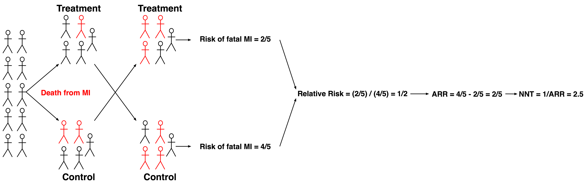

```{r setup, include=FALSE}
knitr::opts_chunk$set(echo = FALSE, warning = FALSE, message = FALSE, 
                      fig.retina = 3, fig.align = 'center')
library(ggplot2)
library(metafor)
library(dplyr)
library(tidyr)
library(xaringanthemer)

# Set the theme
style_mono_accent(
  base_font_size = '18px',
  header_font_google = google_font("Merriweather"),
  text_font_google = google_font("Open Sans"),
  code_font_google = google_font("Fira Mono"),
  colors = c(
    red = "#f34213",
    purple = "#3e2f5b",
    orange = "#ff8811",
    green = "#136f63",
    white = "#FFFFFF"
  )
)
```

class: middle, center, inverse

# Evidence-Based Medicine: Core Concepts and Study Designs

### A Lecture for Pediatric Residents

---

class: middle

# Agenda: Full Lecture Overview

.pull-left[
**Part 1: Statistics & Measures (Approx. 30 minutes)**
1.  **Introduction to EBM** - 2 minutes
2.  **Basic Statistical Terms** - 5 minutes
3.  **Accuracy versus Precision** - 2 minutes
4.  **Statistical Inference & Distributions** - 6 minutes
5.  **Hypothesis Testing** - 5 minutes
6.  **Common Clinical/Epidemiological Metrics** - 8 minutes
7.  **Important Caveats** - 2 minutes
]

.pull-right[
**Part 2: Study Designs & Biases (Approx. 30 minutes)**
1.  **Review of Key Concepts** - 2 minutes
2.  **Types of Biases** - 8 minutes
3.  **Overview of Study Types** - 12 minutes
4.  **Limitations of Each Study Type** - 6 minutes
5.  **Conclusion & Q&A** - 2 minutes
]

---

class: middle, center

# Basic Statistical Terms

---

class: middle

# P-value: What It Actually Means

.pull-left[
**Definition:** Probability of observing results this extreme (or more extreme) **IF the null hypothesis is true**

**What p < 0.05 means:**
- IF there's truly no effect
- THEN there's < 5% chance of seeing this result
- We reject "no effect" hypothesis
]

.pull-right[
**Common Misconceptions:**
- ❌ 5% chance null hypothesis is true
- ❌ 95% chance alternative is true  
- ❌ Probability result was due to chance

**Correct Interpretation:**
- ✅ Evidence against null hypothesis
- ✅ Statistical significance at α = 0.05
]

---

class: middle

# Confidence Interval (CI)

.pull-left[
**Definition:** Range of plausible values for the true population parameter

**95% CI Interpretation:**
- If we repeated the study many times
- 95% of calculated CIs would contain the true value
- Provides precision estimate
]

.pull-right[
**Relationship to P-value:**
- For differences: CI excluding 0 → p < 0.05
- For ratios: CI excluding 1 → p < 0.05
- Wider CI = less precision
- Narrower CI = more precision
]

---

class: middle

# Efficacy vs Effectiveness

.pull-left[
### Efficacy
**"Can it work?"**
- Ideal conditions
- Controlled settings
- High adherence
- Selected patients
- RCT environment
]

.pull-right[
### Effectiveness  
**"Does it work in practice?"**
- Real-world conditions
- Routine clinical practice
- Variable adherence
- Diverse patients
- Practical constraints
]

---

class: middle, center

# Accuracy and Precision

---

class: middle, center

# Visual Reminder: Accuracy vs Precision

```{r precision-accuracy, out.width="60%", fig.asp=0.6}
# Create accuracy/precision demonstration
set.seed(123)
par(mfrow=c(2,2), mar=c(2,2,3,2))

# High accuracy, high precision
plot(rnorm(20, 0, 0.3), rnorm(20, 0, 0.3), xlim=c(-3,3), ylim=c(-3,3), 
     pch=19, col="blue", main="High Accuracy\nHigh Precision", 
     xlab="", ylab="", cex=1.2)
symbols(0, 0, circles=0.5, add=TRUE, inches=FALSE)
points(0, 0, pch=4, cex=2, lwd=3, col="red")

# High accuracy, low precision  
plot(rnorm(20, 0, 1.2), rnorm(20, 0, 1.2), xlim=c(-3,3), ylim=c(-3,3),
     pch=19, col="green", main="High Accuracy\nLow Precision",
     xlab="", ylab="", cex=1.2)
symbols(0, 0, circles=0.5, add=TRUE, inches=FALSE)
points(0, 0, pch=4, cex=2, lwd=3, col="red")

# Low accuracy, high precision
plot(rnorm(20, 1.5, 0.3), rnorm(20, 1.5, 0.3), xlim=c(-3,3), ylim=c(-3,3),
     pch=19, col="orange", main="Low Accuracy\nHigh Precision", 
     xlab="", ylab="", cex=1.2)
symbols(0, 0, circles=0.5, add=TRUE, inches=FALSE)
points(0, 0, pch=4, cex=2, lwd=3, col="red")

# Low accuracy, low precision
plot(rnorm(20, 1.5, 1.2), rnorm(20, 1.5, 1.2), xlim=c(-3,3), ylim=c(-3,3),
     pch=19, col="purple", main="Low Accuracy\nLow Precision",
     xlab="", ylab="", cex=1.2)
symbols(0, 0, circles=0.5, add=TRUE, inches=FALSE)
points(0, 0, pch=4, cex=2, lwd=3, col="red")
```

---

class: middle

# Accuracy vs Precision Definitions

.pull-left[
**Accuracy**
- How close to the TRUE value
- Think: hitting the bullseye
- Threatened by **bias** (systematic error)
- Results close to reality
]

.pull-right[
**Precision**
- How consistent/reproducible
- Think: tight grouping of shots
- Threatened by **random error** (small sample)
- Narrow confidence intervals
]

---

class: middle, center

# Statistical Inference & Distributions

---

class: middle

# Distribution Properties Matter

.pull-left[
```{r normal-dist, out.width="100%", fig.asp=0.8}
norm <- rnorm(10000, sd = 1)
ggplot(data.frame(data = norm), aes(data)) + 
  geom_histogram(binwidth = 0.2, fill = 'lightblue', color = 'black', alpha = 0.7) + 
  xlim(-4, 4) + 
  ylim(0, 1000) +
  ggtitle("Normal Distribution") + 
  labs(x="Value", y="Frequency") +
  theme_minimal(base_size = 14) +
  annotate("text", x = -3.5, y = 950, label = "Mean = Median = Mode", size=4, hjust = 0) +
  annotate("text", x = -3.5, y = 850, label = "68% within ±1 SD", size=4, hjust = 0) +
  annotate("text", x = -3.5, y = 750, label = "95% within ±2 SD", size=4, hjust = 0) +
  annotate("text", x = -3.5, y = 650, label = "99.7% within ±3 SD", size=4, hjust = 0)
```
]

.pull-right[
```{r t-dist, out.width="100%", fig.asp=0.8}
studentt <- rt(10000, df=2)
ggplot(data.frame(data = studentt), aes(data)) + 
  geom_histogram(binwidth = 0.2, fill = 'lightgreen', color = 'black', alpha = 0.7) + 
  xlim(-4, 4) + 
  ylim(0, 1000) +
  ggtitle("Student t Distribution") + 
  labs(x="Value", y="Frequency") +
  theme_minimal(base_size = 14) +
  annotate("text", x = -3.5, y = 950, label = "Mean = Median = Mode", size=4, hjust = 0) +
  annotate("text", x = -3.5, y = 850, label = "Heavier tails", size=4, hjust = 0) +
  annotate("text", x = -3.5, y = 750, label = "CI depends on df", size=4, hjust = 0)
```
]

---

class: middle

# Real Data Can Be Complex

.pull-left[
```{r unimodal, out.width="100%", fig.asp=0.8}
norm <- rnorm(10000, mean = 5, sd = 1)
ggplot(data.frame(data = norm), aes(data)) + 
  geom_histogram(binwidth = 0.1, fill = 'lightcoral', color = 'black', alpha = 0.7) + 
  xlim(0, 10) + 
  ylim(0, 600) +
  ggtitle("Unimodal Distribution") + 
  theme_minimal(base_size = 14) +
  labs(x="Value", y="Frequency")
```

**Single peak** - homogeneous population
]

.pull-right[
```{r bimodal, out.width="100%", fig.asp=0.8}
norm1 <- rnorm(5000, mean = 3, sd = 0.8)
norm2 <- rnorm(5000, mean = 6, sd = 0.8)
ggplot(data.frame(data = c(norm1, norm2)), aes(data)) + 
  geom_histogram(binwidth = 0.1, fill = 'lightsalmon', color = 'black', alpha = 0.7) + 
  xlim(0, 10) + 
  ylim(0, 600) +
  ggtitle("Bimodal Distribution") + 
  theme_minimal(base_size = 14) +
  labs(x="Value", y="Frequency")
```

**Two peaks** - distinct subgroups
]

---

class: middle

# Skewed Distributions: Order Matters

.pull-left[
```{r right-skew, out.width="100%", fig.asp=0.8}
Mode <- function(x) {
  ux <- unique(x)
  ux[which.max(tabulate(match(x, ux)))]
}
r.skew <- rchisq(100000, df = 5)
ggplot(data.frame(data = r.skew), aes(data)) +
  geom_histogram(binwidth = 0.4, fill = 'lightgray', color = 'black', alpha = 0.7) + 
  geom_vline(xintercept = mean(r.skew), linetype = 'dotted', size = 1.2, color = 'darkblue') +
  geom_vline(xintercept = median(r.skew), linetype = "dashed", size = 1.2, color = 'darkgreen') +
  geom_vline(xintercept = Mode(round(r.skew, digits = 2)), linetype = "solid", size = 1.2, color = 'darkred') +
  xlim(0, 25) + 
  ylim(0, 7000) +
  ggtitle("Right Skewed (Positive)") + 
  labs(x="Value", y="Frequency") +
  theme_minimal(base_size = 12) +
  annotate("text", x = 12, y = 6000, label = "Mode < Median < Mean", size = 5, hjust = 0, fontface = "bold")
```
]

.pull-right[
```{r left-skew, out.width="100%", fig.asp=0.8}
l.skew <- 30 - rchisq(100000, df = 5)
ggplot(data.frame(data = l.skew), aes(data)) + 
  geom_histogram(binwidth = 0.4, fill = 'lightgray', color = 'black', alpha = 0.7) + 
  geom_vline(xintercept = mean(l.skew), linetype = 'dotted', size = 1.2, color = 'darkblue') +
  geom_vline(xintercept = median(l.skew), linetype = "dashed", size = 1.2, color = 'darkgreen') +
  geom_vline(xintercept = Mode(round(l.skew, digits = 2)), linetype = "solid", size = 1.2, color = 'darkred') +
  xlim(5, 30) + 
  ylim(0, 7000) +
  ggtitle("Left Skewed (Negative)") + 
  theme_minimal(base_size = 12) +
  labs(x="Value", y="Frequency") +
  annotate("text", x = 8, y = 6000, label = "Mean < Median < Mode", size = 5, hjust = 0, fontface = "bold")
```
]

---

class: middle

# Quick Quiz: Skewed Distribution

.pull-left[
**Which order (left to right) for Right Skewed?**

A. mean, median, mode  
B. mode, mean, median  
C. median, mode, mean  
D. **mode, median, mean**  
E. mean, mode, median

**Remember:** Tail direction = skew direction
]

.pull-right[
```{r quiz-plot, out.width="100%", fig.asp=0.8}
r.skew <- rchisq(100000, df = 5)
ggplot(data.frame(data = r.skew), aes(data)) +
  geom_histogram(binwidth = 0.4, fill = 'lightgray', color = 'black', alpha = 0.7) + 
  geom_vline(xintercept = mean(r.skew), linetype = 'dotted', size = 1.2, color = 'darkblue') +
  geom_vline(xintercept = median(r.skew), linetype = "dashed", size = 1.2, color = 'darkgreen') +
  geom_vline(xintercept = Mode(round(r.skew, digits = 2)), linetype = "solid", size = 1.2, color = 'darkred') +
  xlim(0, 25) + 
  ylim(0, 7000) +
  theme_minimal(base_size = 14) +
  labs(x="", y="")
```
]

---

class: middle, center

# Hypothesis Testing

---

class: middle

# Statistical Tests by Data Type

.pull-left[
**Categorical Data (Counts)**
- **Chi-square test:** 2+ categorical variables
- **Fisher exact test:** 2×2 tables, small cells
- *Example:* Vaccination status vs disease outcome

**Quantitative + Groups**
- **T-test:** Compare 2 group means
  - *Paired:* Before/after same subjects
  - *Independent:* Different groups
- **Mann-Whitney U:** Non-parametric alternative
- **ANOVA:** Compare 3+ group means
]

.pull-right[
**Ordinal Data (Ranked)**
- **Spearman correlation:** Monotonic relationships
- *Example:* Disease severity (mild/moderate/severe) vs pain score

**Two Quantitative Variables**
- **Pearson correlation:** Linear relationships
- *Example:* Age vs height in children
]

---

class: middle, center

# Question

.pull-left[
**Table 1: OCP Use and Blood Clots**

| | Clot | No Clot | Total |
|---|---:|---:|---:|
| **OCP Use** | 500 | 400 | 900 |
| **No OCP Use** | 80 | 20 | 100 |
| **Total** | 580 | 420 | 1000 |
]

.pull-right[
**Best method to assess association?**

A. Two sample T-test  
B. Analysis of variance  
C. Pearson correlation  
D. Chi-square test
E. Spearman correlation
]

---

class: middle, center

# Question

.pull-left[
**Table 1: OCP Use and Blood Clots**

| | Clot | No Clot | Total |
|---|---:|---:|---:|
| **OCP Use** | 500 | 400 | 900 |
| **No OCP Use** | 80 | 20 | 100 |
| **Total** | 580 | 420 | 1000 |
]

.pull-right[
**Best method to assess association?**

A. Two sample T-test  
B. Analysis of variance  
C. Pearson correlation  
D. **Chi-square test** ✓  
E. Spearman correlation

**Why Chi-square?** Two categorical variables (OCP: Yes/No, Clot: Yes/No)
]

---

class: middle

# Hypothesis Testing Framework

.pull-left[
**Null Hypothesis (H₀)**
- Default assumption
- "No effect," "no difference," "no relationship"
- What we test against

**Alternative Hypothesis (H₁)**
- What we want to demonstrate
- "There IS an effect/difference/relationship"
- Never "proven," only supported
]

.pull-right[
**Decision Rules**
- **Reject H₀ if p < 0.05** (typical)
- For ratios: 95% CI not including 1
- For differences: 95% CI not including 0

**Board Exam Tip:** Assume H₀ rejected when p < 0.05
]

---

class: middle

# Four Possible Outcomes

.center[
| | H₀ True | H₀ False |
|---|---|---|
| **Reject H₀** | Type I Error (α) | Correct ✓ |
| **Fail to Reject H₀** | Correct ✓ | Type II Error (β) |
]

.pull-left[
**Type I Error (α = False Positive)**
- Conclude effect when none exists
- Usually set at 5%

**Power (1-β)**
- Probability of detecting true effect
- Increases with sample size
]

.pull-right[
**Type II Error (β = False Negative)**  
- Miss a real effect
- Often due to small sample

**Key Point:** Bigger sample = More power
]

---

class: middle, center

# Clinical/Epidemiological Metrics

---

class: middle

# Essential Metrics You Must Know

.pull-left[
### The Big Four
1. **Odds Ratio (OR)**
2. **Risk Ratio (RR)**  
3. **Risk Difference (RD)**
4. **Number Needed to Treat (NNT)**
]

.pull-right[
### When to Use Each
- **OR:** Case-control studies, rare diseases
- **RR:** Cohort studies, RCTs  
- **RD:** When absolute risk matters
- **NNT:** Clinical decision-making
]

---

class: middle, center

# Sample Data for Calculations

```{r sample-data, out.width='60%', fig.asp=0.7}
# Example data
dat <- data.frame(
  Group = factor(c("Exposed", "Non-Exposed"), levels = c("Exposed", "Non-Exposed")),
  Disease = c(30, 20),
  No_Disease = c(70, 80)
) 

tdat <- dat %>% pivot_longer(c(Disease, No_Disease))

ggplot(tdat, aes(x = Group, y = value, fill = name)) +
  geom_bar(stat = "identity", position = position_stack(reverse = TRUE)) +
  scale_fill_manual(values = c(Disease = "#f34213", No_Disease = "#136f63"), 
                    name = "Outcome") +
  labs(x = 'Exposure Status', y = 'Count', 
       title = "Disease Distribution by Exposure") +
  theme_minimal(base_size = 16) +
  theme(legend.position = "top")
```

---

class: middle, center

# Standard 2×2 Table Format

| | Disease | No Disease | Total |
|---|---:|---:|---:|
| **Exposed** | 30 (a) | 70 (b) | 100 (a+b) |
| **Not Exposed** | 20 (c) | 80 (d) | 100 (c+d) |
| **Total** | 50 (a+c) | 150 (b+d) | 200 (N) |

**Cell Labels:** Use a, b, c, d for formulas

---

class: middle

# Understanding Odds

.pull-left[
**Formula:**
$$\text{Odds} = \frac{P(\text{Event})}{P(\text{No Event})}$$

**Exposed Group:**
- P(Disease) = 30/100 = 0.3
- P(No Disease) = 70/100 = 0.7  
- **Odds = 30/70 = 0.43**
]

.pull-right[
**Non-Exposed Group:**
- P(Disease) = 20/100 = 0.2
- P(No Disease) = 80/100 = 0.8
- **Odds = 20/80 = 0.25**

**Shortcut:** Odds = a/b and c/d
]

---

class: middle

# Odds Ratio (OR) Calculation

```{r or-calc}
OR <- (dat$Disease[1] / dat$No_Disease[1]) / (dat$Disease[2] / dat$No_Disease[2])
CI.h_or <- exp(log(OR) + 1.96*sqrt(1/dat$Disease[1] + 1/dat$No_Disease[1] + 1/dat$Disease[2] + 1/dat$No_Disease[2]))
CI.l_or <- exp(log(OR) - 1.96*sqrt(1/dat$Disease[1] + 1/dat$No_Disease[1] + 1/dat$Disease[2] + 1/dat$No_Disease[2]))
```

.pull-left[
**Formula:**
$$OR = \frac{\text{Odds}_{\text{exposed}}}{\text{Odds}_{\text{unexposed}}} = \frac{a \times d}{b \times c}$$

**Our Data:**
$$OR = \frac{30 \times 80}{70 \times 20} = \frac{2400}{1400} = `r round(OR, 2)`$$
]

.pull-right[
**95% Confidence Interval:**
$$e^{\ln(OR) \pm 1.96\sqrt{\frac{1}{a}+\frac{1}{b}+\frac{1}{c}+\frac{1}{d}}}$$

**Result:** (`r round(CI.l_or, 2)`, `r round(CI.h_or, 2)`)

**Interpretation:** Exposed group has `r round(OR, 2)` times the odds of disease
]

---

class: middle

# Risk Ratio (RR) Calculation

```{r rr-calc}
dat$Total <- dat$Disease + dat$No_Disease
RR <- (dat$Disease[1] / dat$Total[1]) / (dat$Disease[2] / dat$Total[2])
CI.h_rr <- exp(log(RR) + 1.96*sqrt(1/dat$Disease[1] + 1/dat$Disease[2] - 1/(dat$Disease[1] + dat$No_Disease[1]) - 1/(dat$Disease[2] + dat$No_Disease[2])))
CI.l_rr <- exp(log(RR) - 1.96*sqrt(1/dat$Disease[1] + 1/dat$Disease[2] - 1/(dat$Disease[1] + dat$No_Disease[1]) - 1/(dat$Disease[2] + dat$No_Disease[2])))
```

.pull-left[
**Formula:**
$$RR = \frac{\text{Risk}_{\text{exposed}}}{\text{Risk}_{\text{unexposed}}}$$

**Calculations:**
- Risk_exposed = 30/100 = 0.3
- Risk_unexposed = 20/100 = 0.2  
- **RR = 0.3/0.2 = `r RR`**
]

.pull-right[
**95% CI:** (`r round(CI.l_rr, 2)`, `r round(CI.h_rr, 2)`)

**Interpretation:** Exposed group has `r RR` times the risk

**Note:** Only use with cohort studies/RCTs!
]

---

class: middle

# Risk Difference & NNT

```{r rd-nnt}
RD <- (dat$Disease[1] / dat$Total[1]) - (dat$Disease[2] / dat$Total[2])
NNT <- 1 / abs(RD)
```

.pull-left[
**Risk Difference (RD):**
$$RD = \text{Risk}_{\text{exposed}} - \text{Risk}_{\text{unexposed}}$$
$$RD = 0.3 - 0.2 = `r RD`$$

**Interpretation:** 10% absolute increase in risk
]

.pull-right[
**Number Needed to Harm (NNH):**
$$NNH = \frac{1}{|RD|} = \frac{1}{|`r RD`|} = `r NNT`$$

**Interpretation:** For every `r NNT` people exposed, 1 additional person gets disease

**Clinical Relevance:** Practical impact measure
]

---

class: middle

# Interpretation Guide

.pull-left[
**Odds Ratio (OR)**
- OR = 1: No association
- OR > 1: Increased odds  
- OR < 1: Decreased odds (protective)

**Risk Ratio (RR)**  
- RR = 1: No association
- RR > 1: Increased risk
- RR < 1: Decreased risk (protective)
]

.pull-right[
**Risk Difference (RD)**
- RD = 0: No difference
- RD > 0: Increased absolute risk
- RD < 0: Decreased absolute risk

**Statistical Significance**
- **For ratios:** 95% CI excludes 1
- **For differences:** 95% CI excludes 0
]

---

class: middle, center

# Important Caveats

---

class: middle

# Critical Points to Remember

.pull-left[
**When CI Includes 1 (for ratios):**
- Result NOT statistically significant
- "No effect" is plausible
- Be cautious interpreting

**Risk Ratios vs Odds Ratios:**
- RR only from population samples
- OR from case-control studies
- OR approximates RR for rare diseases
]

.pull-right[
**Subgroup Analysis Warning:**
- Seems clinically relevant
- **Major source of false positives**
- Better for hypothesis generation
- Avoid definitive conclusions

**Multiple Testing Problem:**
- 20 tests → expect 1 false positive
- α = 0.05 means 5% false positive rate
]

---

class: middle

# Multiple Testing Reality Check

.pull-left[
.center[
```{r fake-tests-table, out.width="50%"}
# Create a fake table showing multiple comparisons
test_data <- data.frame(
  Variable = c("Age", "Gender", "BMI", "Smoking", "Exercise", "Diet", 
               "Sleep", "Stress", "Education", "Income", "Location", "Season"),
  P_value = c("0.042*", "0.156", "0.678", "0.023*", "0.891", "0.034*",
              "0.456", "0.012*", "0.789", "0.067", "0.445", "0.028*"),
  Significant = c("Yes", "No", "No", "Yes", "No", "Yes", 
                  "No", "Yes", "No", "No", "No", "Yes")
)

knitr::kable(test_data, caption = "Example: Multiple Comparisons Problem")
```
]
]

.pull-right[
**The Problem:**
- 12 tests performed
- 5 "significant" results  
- Expected by chance: 12 × 0.05 ~ 1

**Reality Check:**
- Most are likely false positives due to nearness to 0.05
- Need correction for multiple testing
- Better for hypothesis generation
]

---

class: middle, center, inverse

# Part 2: Study Designs & Biases

---

class: middle

# Key Concepts Review

.pull-left[
**Internal Validity**
- Results true for study participants
- Free from bias and confounding  
- Cause-and-effect relationships
- High control = high internal validity
]

.pull-right[
**External Validity (Generalizability)**
- Results apply to other populations
- Relevant to YOUR patients
- Real-world applicability
- Often trade-off with internal validity
]

---

class: middle, center

# Types of Biases

---

class: middle

# Design & Hidden Variable Biases

.pull-left[
**Selection Bias**
- Non-random group assignment
- Systematic baseline differences
- *Example:* Healthier patients get new treatment
- *Solution:* Randomization

**Observer-Expectancy Bias**  
- Researcher expectations influence observations
- *Example:* Doctor expects drug to work
- *Solution:* Blinding
]

.pull-right[
**Effect Modification**
- Effect varies by third variable
- *Example:* Drug works in boys, not girls
- *Solution:* Stratified analysis

**Confounding**
- Third variable causes apparent association
- *Example:* Coffee → cancer (but smoking is real cause)
- *Solutions:* Randomization, regression analysis
]

---

class: middle

# Information (Measurement) Biases

.pull-left[
**Recall Bias**
- Diseased patients remember exposures better
- *Example:* Birth defect mothers recall medications
- *Solutions:* Objective data, medical records

**Procedure Bias**
- Systematic differences in data collection
- *Example:* More time spent with treatment group
- *Solutions:* Standardized protocols, blinding
]

.pull-right[
**Instrument Bias**
- Faulty or inconsistent measurement tools
- *Example:* Miscalibrated BP cuff, unclear survey
- *Solutions:* Calibration, validation, reliability testing
]

---

class: middle

# Time & Completion Biases

.pull-left[
**Lead-Time Bias**
- Earlier detection ≠ longer survival
- *Example:* Screening finds cancer 5 years earlier, same death age
- *Solution:* Measure from symptom onset

**Attrition Bias**
- Systematic withdrawal related to outcome
- *Example:* Side effects cause dropout
- *Solutions:* Intention-to-treat analysis
]

.pull-right[
**Loss-to-Follow-Up**
- Participants don't return for visits
- Can be random or systematic
- *Solutions:* Good contact maintenance, incentives
- **Concern if >20% loss**
]

---

class: middle, center

# The pyramid of evidence is a hierarchy


--- 

class: middle, center

# Experimental Trials

---

class: middle, center

# Randomized control trial is in the name


---

class: middle

# Randomized control - gold standard

--

- This is widely considered the gold standard for clinical evidence
--
<br><br>
- Question: __Primary__ purpose of randomization?
--

- Answer: To eliminate __selection bias__
  - Selection bias (at the time of randomization) is eliminated if randomization is technically correct
--

<br><br>
- Question: Secondary goal of randomization?
--

- Answer: To help with confounding
  - Confounders are not necessarily eliminated even with perfect technical execution
--
<br><br>
- Can use relative risk because investigator knows prevalence of disease and prior exposures

---

class: middle

# Randomized control - limitations

- Can still technically suffer from selection bias (as defined by epidemiologists). Why?
--
<br>
  - Loss to follow up
--
<br><br>
- They may or may not externalize well
--
<br><br>
- There are may ethical concerns in pediatrics
--
<br><br>
- They are ridiculously expensive

---

class: middle

# Crossover trial - groups switch



<br>
- This post hoc analysis is overly simplified for real life
 
- This understanding is sufficient for boards
 
- Includes initial randomization

- Also, confounders reduced because a patient can serve as their own control

---

class: middle, center

# Observational Studies

---

class: middle

# Prospective cohorts - into the future


---


class: middle

# Retrospective cohorts - from the past


---

class: middle

# Cohorts form the next level of evidence
 
--

- Can still use relative risk because investigator knows prevalence of exposure and disease
- Subjects vary by exposure status
- Can calculate incidence
--
<br><br>
- __Selection bias__ is the biggest problem
  - Investigator has infinite control over inclusion
--
<br><br>
- Other Prospective biases
  - Attrition - people leave the trial intentionally
  - Loss-to-follow up - people just stop showing up
  - Confounding - baseline characteristics or ongoing characteristics are difference
  - Hawthorne - people act differently once observed
--
<br><br>
- Retrospective bias
  - Information bias

---

class: middle, center

# Case-control trials measure chance of exposure given disease


---

class: middle

# Case-control forms the next level down from cohorts
--

- Must use odds ratio because investigator does not know prevalence of disease
--
<br><br>
- Subjects grouped by cases and controls
  - Measure __odds of exposure__ in case and control groups
--
<br><br>
- Significantly improved power and decreased resource requirements compared to cohorts 
  - Due to cases being selected at out set
--
<br><br>
- __Selection and Recall biases__ are the biggest problem
  - Selecting appropriate controls is __highly__ non-trivial
  - Sick people remember exposures (e.g. Melanoma patients stew about their sunburns)
--
<br><br>
- Also common
   - Information biases
--
<br><br>
- __Cannot calculate incidence or prevalence__

---

class: middle, center

# Cross-sectional trials measure exposure and disease simultaneously


---

class: middle

# Cross-sectional study - next level

--

- __Quick, cheap, and easy__
  - Typically this is a starting point
--
<br><br>
- Can establish prevalence of disease
--
<br><br>
- Must use chi-squared or correlation for statistical test
--
<br><br>
- Subjects can be grouped by exposure and diease in to the 2x2 contingency
--
<br><br>
- __Cannot establish causation__
--
<br><br>
- Cannot calculate risk metrics
 
---

class: middle, center

# Questions?

### Thank you for your attention!

**Remember:** Evidence-based medicine combines the best research evidence with clinical expertise and patient values.

---